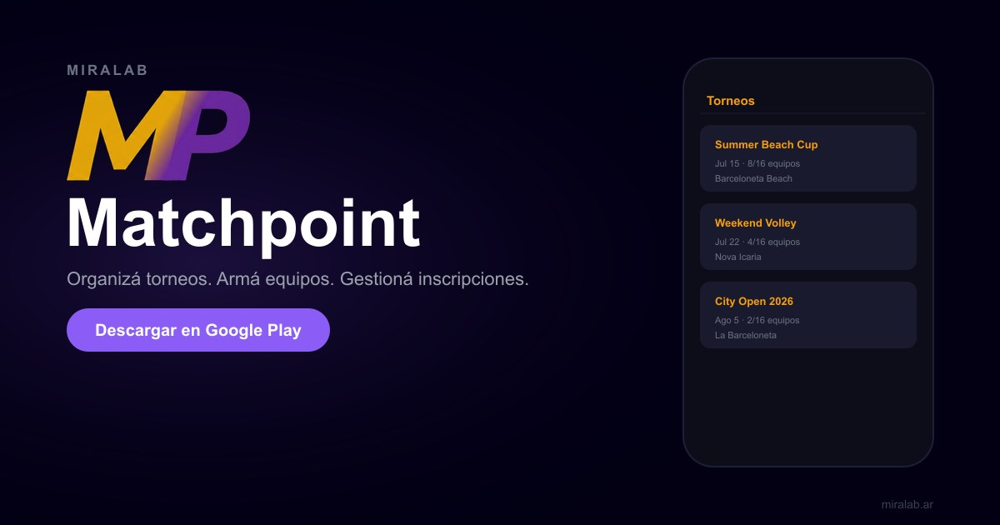
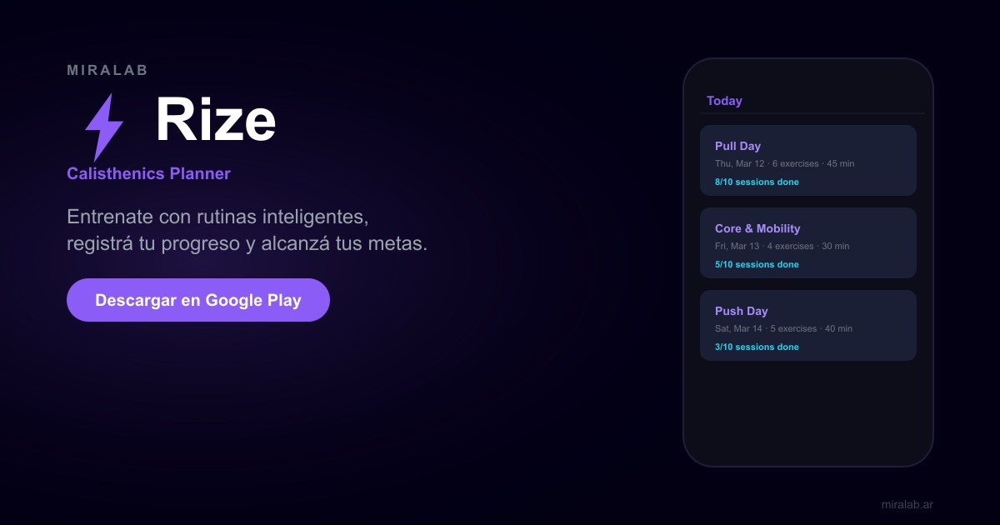
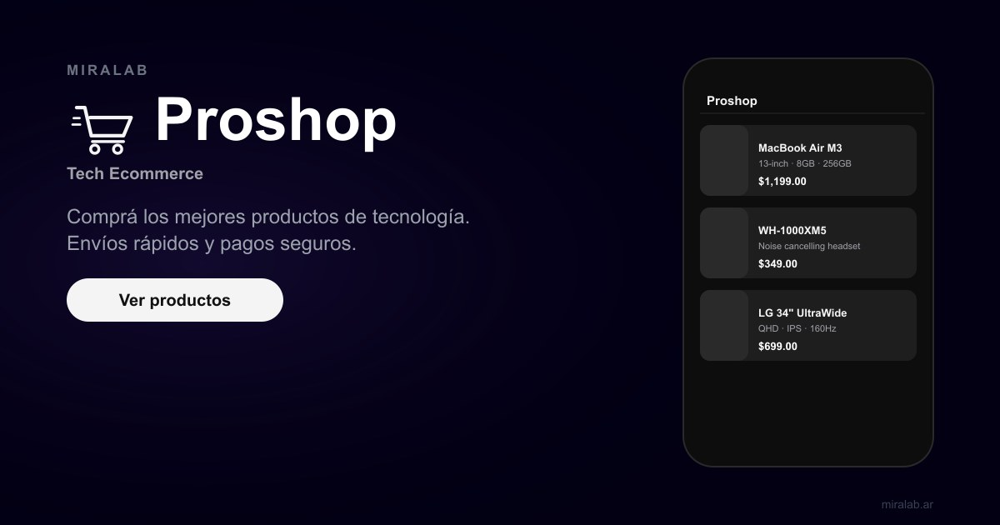

<h1 align="center">Octavio Frangipani</h1>
<h1 align="center">Senior React Frontend Engineer</h1>

**TypeScript · React · Next.js · Microfrontends**

Barcelona, Spain

---

## Tech I work with

  
  
  
  
  
  
  
  
  
  
  

---

## About

Senior software engineer with **4+ years** of experience, focused on **frontend architecture** with **React** and **TypeScript**. I design and scale **enterprise SPAs** using **Webpack Module Federation**, shared **NPM** component libraries, and **Next.js** dashboards. I care about **TDD**, **clean code**, **WCAG accessibility**, and turning **Figma** into pixel-perfect UIs. I work closely with UX in **Agile / Kanban** teams and ship with **CI/CD**, **Jest**, and **Cypress**.

---

## MIRALAB — Digital studio & portfolio

*Web & mobile apps, AI-powered solutions, and full-stack delivery — built at [miralab.ar](https://www.miralab.ar/es).*

---

## Featured projects

### Matchpoint

  

Mobile app for **beach volleyball** tournaments — modular architecture and a clear in-game experience.

**Stack:** React · TypeScript · API integrations

[Repository](https://github.com/octapf/matchpoint) · [Studio](https://www.miralab.ar/es)

---

### Rize

  

Calisthenics training app focused on **performance**, modern **UX**, and full-stack integration.

**Stack:** Next.js · TypeScript · Node.js

[Repository](https://github.com/octapf/rize) · [Studio](https://www.miralab.ar/es)

---

### Proshop

  

**E-commerce** for tech products — modern shopping UX, performance, and scalable architecture.

**Stack:** Next.js · TypeScript · E-commerce

[Repository](https://github.com/octapf/proshop) · [Studio](https://www.miralab.ar/es)

---

## Top languages

---

*Fun fact: Debugging is like being the detective in a crime movie where you're also the murderer.*

